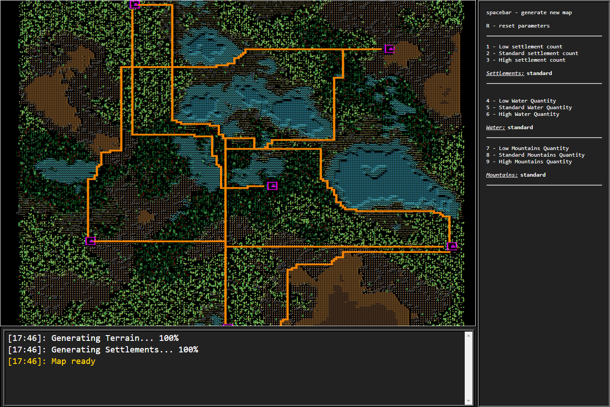
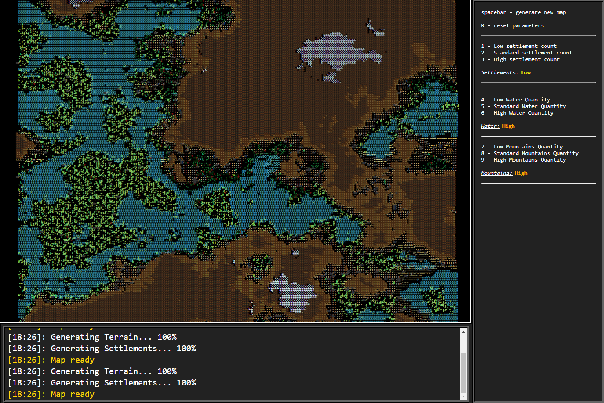

# Rpg map generator

Simple map generator using 3 layers of perlin noise to create the terrain (simulating altitude, moisture and temperature ) and the pathfinding algorithm A* to generate the roads between towns, that are randomly placed in the map.
It uses a webworker to do all the generating behind the scenes and the UI can show the progress.

This was going to be a game but I decided to just keep it like this for the moment. (maybe in the future I'll continue)

Here some screenshots:

